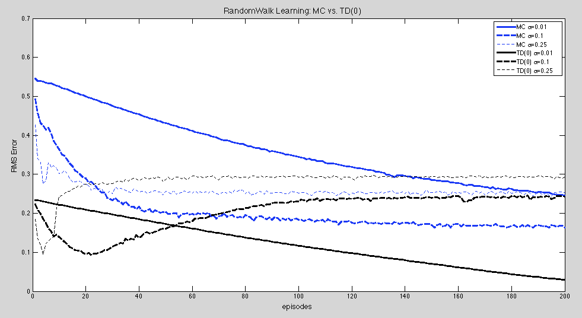

<h1> RandomWalk Learning: A Comparison Between MC and TD</h1>

	<h3> Introduction </h3>
	

		Taking the Random Walk, example 6.2 from the reinforcement leanring book by Sutton & Barto, we wish to recreate the value prediction process under a random walk policy and compare the learning curves between MC and TD(0) methods with various step-size parameter.
	

	<h3> Methods </h3>
	

		Just like the original Random Walk setup, our Markov process consists of five non-terminal and two terminal states. 
		 
		
		 
		Each episode starts at the center "C" state, with a random walk policy of 0.5 to go either directions, and terminates at "L" or "R" states. The rewards for all state-actions are zero, except for taking right action at state "E", which gives a reward of value one.
	

	

		Following the Random Walk policy described above, our objective is to compare how well Monte Carlo and TD(0) predict the value functions over a progression of episodes. As noted in the textbook, a typical Monte Carlo updates the value function as following:
		 
		
		 
		where R_t is the accumulated return collected from time t all the way to the end of each episode, and alpha is the step-size parameter. On the other hand, TD(0) updates the value prediction after each time step in the Markov process according to the following equation:
		 
		
		 
		where r_(t+1) is the reward obtained following the next action.
	

	

		In our experiment, we want to compare how well the two methods predict the value function in Random Walk, as well as how the step-size parameter influnces the results. We run each method on the Random Walk Markov process for 200 episodes, and average the RMS error from the theoretical value over 500 trials.		
	

	<h3> Results </h3>
	

		For constant-alpha Monte Carlo, larger step-size parameter (alpha) does provide faster convergence, but it also raises the optimal RMS error. If we choose alpha = 0.1 or less, it seems like there is still room for improvement even at 200 episodes. However, at higher step-size, the optimal RMS error learned by MC seems to be higher.
		 
		 
		
		 
		The effect of higher alpha given more episodes mentioned earlier is even more obvious for TD(0). Namely, we can see the learning curve reaches the optimal at a higher RMS error and increases again when exposed more espisodes.
		 
		 
		
		 
		When comparing the learning curves of two methodsd side by side, we can see that although TD(0) generally has a lower error rate in the begining, it doesn't always outperform MC in the long run. For instance, when choosing alpha to be 0.1, MC actually has lower error rates than TD(0) after around 70 episodes.
		 
		 
		
		 

	

	<h3> Conclusion </h3>
	

		The Random Walk example from Sutton & Barto's textbook was originally designed to demonstrate the advantage of using TD(0) over Monte Carlo. However, we can see that this is not always necessarily true if we don't pick relevant parameters carefully. Moreover, more episodes of experience don't always translate into better prediction results. In fact, we can see how the error rates increase after reaching the optimal when using large step-size and more episodes are fed into the system.
	

